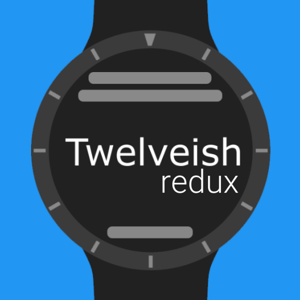
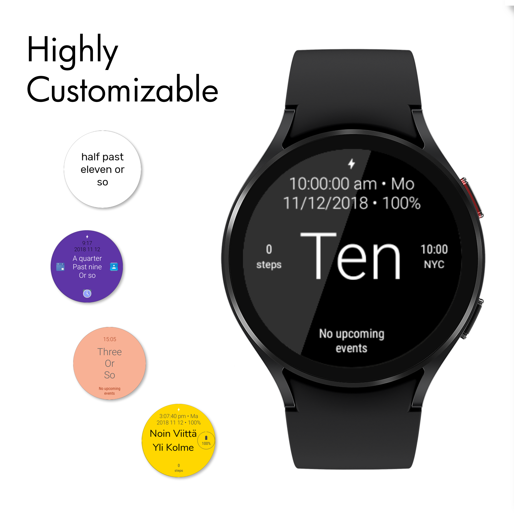

# Twelveish (redux) - Watch face for Wear OS (Android Wear)

Twelveish (redux) is a project to bring back to recent Wear OS (Android Wear) watches a unique Watch Face that displays the **approximate time in words** (in multiple languages). It also shows the exact time (digital clock) and day of the week on the top, date and battery percentage slightly below, a complication on the bottom (on all Wear OS versions and Android Wear versions 2.0 and greater). On top of that, Twelveish is **extremely customizable, completely free and open-source**.

### [Download on the Google Play storex](https://play.google.com/store/apps/details?id=com.psychowood.twelveishredux)

## Foreword

Original project was created by [@LayoutXML](https://github.com/LayoutXML/Twelveish) and later updated by [@augustuen](https://github.com/augustuen/Twelveish). 
Since the Play Store version was not working on my Wear OS 3 watch, I decide to hammer it - my Android development skills are less-than-basic at best - and publish it.
(not so) recently Wear OS added a new xml-based format for watch faces called **Watch Face Format (WFF)** and this last update tries to revive it again.

## Watch Face Format (WFF) Reimplementation

To ensure compatibility with the latest Wear OS versions and improve battery efficiency, the watch face has been completely reimplemented using the new **Watch Face Format (WFF)**. This version is more robust and future-proof but is still in active development.

### Missing Features (WFF Version)

Currently, the WFF version is a work-in-progress and many features from the legacy version have not yet been ported:

*   **Advanced Complication Support**: Limited to `SHORT_TEXT` only (missing icons, ranged values/progress bars, and long text).
*   **Granular Ambient Mode Control**: Separate color and visibility settings for Ambient vs. Active modes are not yet fully implemented.
*   **Sophisticated Fuzzy Time Logic**: Complex language-specific rules (e.g., hour-shifting in Dutch/German) are currently using a simplified static mapping.
*   **Advanced Text Styling**: Customizable capitalization (Title Case, ALL CAPS), custom fonts, and fine-grained text size offsets.
*   **Date Customization**: Adjustable date order (DMY/MDY) and separators.

I'm working on bringing these features back but it will take some time-ish. And perhaps add some more.

## Features

In addition to what has been mentioned in the description above, Twelveish offers:

* [ ] Over 30 background colors to choose from
* [ ] Over 30 main and secondary colors both for active mode and ambient
* [ ] 3 complications (2 round, 1 long or round)
* [ ] Option to disable tapping on complications - useful if you constantly open them by accident
* [ ] 16 different date format combinations
* [ ] 5 capitalization options
* [x] 12 and 24 hour digital clock formats
* [ ] show/hide almost any info (digital and word clocks, date, battery percentage, complication) with different combinations both for active and ambient modes
* [ ] 14 languages (Dutch, English, Finnish, French, German, Greek, Hungarian, Italian, Lithuanian, Norwegian, Portuguese, Russian, Spanish and Swedish)
* [ ] 11 fonts that are compatible with all languages
* [ ] Wear OS (Android Wear) 1.5 and above support
* [x] Chin (flat tire) support
* [x] Square screen support
* [ ] Most of the settings above can be set to be different for active and ambient modes, making your watch face even more unique.

## Manual Installation

You can install Twelveish directly from your computer. Method below describes how to run Twelveish directly from the code and not how to sideload already precompiled .apk file. Instructions assume your watch is connected to your computer (either via USB, Wi-Fi, Bluetooth or else). You can always install Twelveish directly from your watch (Wear OS version 5.0 and greater) [Download on the Google Play store](https://play.google.com/store/apps/details?id=com.psychowood.twelveishredux).

### Prerequisites

* Android SDK v35
* Latest Android Build Tools
* Android Support Repository
* Latest Android Studio (recommended)
* Developer options and ADB debugging enabled

### Installing

1. Download the source code or clone the repository.
2. Open Android Studio and choose "Open an Existing Android Studio Project".
3. Choose "watch-face" for Watch Face.
4. Connect your watch via adb
4. Click the Run button.

## Versioning

WFF version starts at 2.5.0

Versions 1.1.1-2.1.1, Twelveish versioning follows this scheme:

* Version code: number of commits to this repository.

* Version name: x.y.z, where z increases by 1 with at least one fix compared to the previous version, y increases by 1 with at least one new feature. y and x additionally increase by 1 if the number after it reaches 10. In that case the number that reaches 10 reverts back to 0.

Versions 1.0.0-1.0.5 followed this scheme:

* Version code: number of commits to this repository

* Version name: 1.0.x, where x is the release number -1.

Phone/companion app (module "phone") follows the same versioning except that the version code is always smaller by 1.

## Privacy policy

Twelveish does not send any anonymous or personally identifiable information - Twelveish does not have an internet permission. Twelveish may locally store complication data to display it on the watch face which Twelveish does not have any control over. This information is not send anywhere else and may be deleted in the OS settings (by pressing "Clear data").

## Acknowledgments

Original version by  Rokas Jankūnas [@LayoutXML](https://github.com/LayoutXML/)

Logo: [@elawhatson](https://github.com/elawhatson)

Translations:

* Dutch: eelcovb [@m3ssage](https://github.com/m3ssage)

* Finnish: Lari Palander [@oh2fhf](https://github.com/oh2fhf)

* French: Kyl12

* German: Robin Roschlau [@roschlau](https://github.com/roschlau)

* Greek: Lefteris Popoff

* Hungarian: Richard Hriech [@richardSin501](https://github.com/richardSin501)

* Italian: Luigi Violin

* Norwegian: Johnny Wiig

* Portuguese: Emanuel Teixeira

* Spanish: David Amian Valle [@amian84](https://github.com/amian84)

* Spanish (improvement): Marco Martinez

* Swedish: Max Sonneby [@StoreMax](https://github.com/StoreMax)

## License

Twelveish (redux) is licensed under "GNU GPLv3" license. Copyright laws apply.

Copyright © 2026 Giacomo Giustozzi (psychowood)
